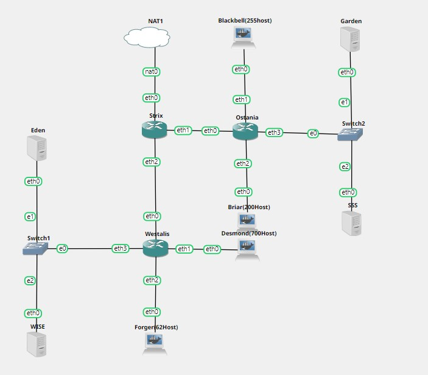

# Jarkom-Modul-5-F05-2022

## Kelompok F05

| Nama | NRP |
| ------------- | ------------- |
| Muhammad Amin | 5025201251 |
| Elthan Ramanda B | 5025201092 |
| Aiffah Kiysa Waafi | 5025201202 |


## Topologi


<br>

Keterangan :

- Eden adalah DNS Server
- WISE adalah DHCP Server
- Garden dan SSS adalah Web Server
- Jumlah Host pada Forger adalah 62 host
- Jumlah Host pada Desmond adalah 700 host
- Jumlah Host pada Blackbell adalah 255 host
- Jumlah Host pada Briar adalah 200 host

## Soal

Setelah kalian mempelajari semua modul yang telah diberikan, Loid ingin meminta bantuan untuk terakhir kalinya kepada kalian. Dan kalian dengan senang hati mau membantu Loid.

a. Tugas pertama kalian yaitu membuat topologi jaringan sesuai dengan rancangan yang diberikan Loid dibawah ini: (topologi ada di atas)

b. Untuk menjaga perdamaian dunia, Loid ingin meminta kalian untuk membuat topologi tersebut menggunakan teknik CIDR atau VLSM setelah melakukan subnetting.

c. Anya, putri pertama Loid, juga berpesan kepada anda agar melakukan Routing agar setiap perangkat pada jaringan tersebut dapat terhubung.

d. Tugas berikutnya adalah memberikan ip pada subnet Forger, Desmond, Blackbell, dan Briar secara dinamis menggunakan bantuan DHCP server. Kemudian kalian ingat bahwa kalian harus setting DHCP Relay pada router yang menghubungkannya.


1. Agar topologi yang kalian buat dapat mengakses keluar, kalian diminta untuk mengkonfigurasi Strix menggunakan iptables, tetapi Loid tidak ingin menggunakan MASQUERADE.
2. Kalian diminta untuk melakukan drop semua TCP dan UDP dari luar Topologi kalian pada server yang merupakan DHCP Server demi menjaga keamanan.
3. Loid meminta kalian untuk membatasi DHCP dan DNS Server hanya boleh menerima maksimal 2 koneksi ICMP secara bersamaan menggunakan iptables, selebihnya didrop.
4. Akses menuju Web Server hanya diperbolehkan disaat jam kerja yaitu Senin sampai Jumat pada pukul 07.00 - 16.00.
5. Karena kita memiliki 2 Web Server, Loid ingin Ostania diatur sehingga setiap request dari client yang mengakses Garden dengan port 80 akan didistribusikan secara bergantian pada SSS dan Garden secara berurutan dan request dari client yang mengakses SSS dengan port 443 akan didistribusikan secara bergantian pada Garden dan SSS secara berurutan.
6. Karena Loid ingin tau paket apa saja yang di-drop, maka di setiap node server dan router ditambahkan logging paket yang di-drop dengan standard syslog level.

Loid berterima kasih pada kalian karena telah membantunya. Loid juga mengingatkan agar semua aturan iptables harus disimpan pada sistem atau paling tidak kalian menyediakan script sebagai backup.

## Jawaban

Untuk CIDR, tabel IP, dll dapat diakses di sheet berikut : 
<a href="https://docs.google.com/spreadsheets/d/1QPYwuEAQ5l8qt_IMnyCh6rmjS_KktdDHTEU0QfUO9sY/edit?usp=sharing">GSHEET</a>

### Topologi

<image src="images/topologi.jpg"><br>

### Labelling

<image src="images/label.jpg"><br>

### CIDR

<image src="images/cidr.jpg"><br>

### NID

<image src="images/nid.jpg"><br>

### Network Configuration


### Routing

### Nomor 1

Masquerade berarti otomatis mendapatkan IP dari interface sekarang, karena tidak boleh menggunakan MASQUERADE, maka ada 2 cara, yaitu dengan mengubah IP dari interface yang terhubung ke NAT menjadi static

Network Konfigurasi Strix <br>
edit network configuration atau ubah file /etc/network/interfaces

NID NAT : 192.168.122.0 <br>
IP NAT : 192.168.122.1

```
auto eth0
iface eth0 inet static
    address 192.168.122.2
    netmask 255.255.255.252
```

Perlu diperhatikan interface strix yang terhubung dengan NAT adalah eth0 lalu jalankan command ini

Pada Router Strix :<br>
```
iptables -t nat -A POSTROUTING -o eth0 -j SNAT -s 10.31.0.0/19 --to-source 192.168.122.2
```

1. -t nat : tabel NAT
2. -A POSTROUTING : tambahkan pengaturan POSTROUTING
3. -o eth0 : pada eth0
4. -j SNAT : ubah Source IP
5. -s 10.31.0.0/19 : pada rentang 10.31.0.0 - 10.31.31.255
6. --to-source 192.168.122.2 : ubah menjadi ip eth0

### Nomor 2

Lakukan drop packet TCP / UDP dari luar topologi (berasal dari NAT) yang menuju ke Eden & Wise

Pada Router Strix :<br>
```
iptables -A FORWARD -d 10.31.4.130 -i eth0 -p tcp --dport 80 -j DROP
iptables -A FORWARD -d 10.31.4.130 -i eth0 -p udp --dport 80 -j DROP

iptables -A FORWARD -d 10.31.4.131 -i eth0 -p tcp --dport 80 -j DROP
iptables -A FORWARD -d 10.31.4.131 -i eth0 -p udp --dport 80 -j DROP

```

1. -A FORWARD : tambahkan pengaturan FORWARD
2. -d [IP] : dengan destination address
3. -i eth0 : yang berasal dari eth0
4. -p [tcp/udp/...] : protocol tcp / udp / lainnya
5. --dport 80 : dengan destination port 80
6. -j DROP : lakukan drop paket

Hati-hati karena koneksi yang berasal dari Eden & Wise tidak akan bisa mengakses internet semisal untuk download package, dll yang menggunakan protokol tcp & udp

### Nomor 3

Pada Eden & Wise : <br>
```
iptables -A INPUT -p icmp -m connlimit --connlimit-above 2 --connlimit-mask 0 -j DROP
```

1. -A INPUT : tambahkan pengaturan INPUT
2. -p icmp : protocol icmp 
3. -m connlimit --connlimit-above 2 --connlimit-mask 0 : batas koneksi maksimal 2 bersamaan
4. -j DROP : lakukan drop paket

#### Nomor 4

Hanya bisa diakses pada Senin-Kamis 07:00-16:00

Perlu diketahuai bahwa <br>
Pada subnet 10.31.19.0/29 terdapat IP Garden, SSS, serta interface pada Ostania yang terhubung <br>

Pada Ostania : <br>
```
iptables -A FORWARD -d 10.31.19.0/29 -m time --weekdays Sat,Sun -j REJECT
iptables -A FORWARD -d 10.31.19.0/29 -m time --timestart 00:00 --timestop 06:59 --weekdays Mon,Tue,Wed,Thu,Fri -j REJECT
iptables -A FORWARD -d 10.31.19.0/29 -m time --timestart 16:01 --timestop 23:59 --weekdays Mon,Tue,Wed,Thu,Fri -j REJECT
```
Hati-hati karena interface Ostania yang terhubung ke Garden & SSS juga terikut tidak bisa dihubungi

Untuk mengubah date pada Ostania untuk testing gunakan perintah berikut

```
date --set "16 Sep 2002 00:00:00"
```

### Nomor 5

Karena ingin dibuat merata, maka kita tinggal mengubah destination address setiap paket kelipatan 2. Untuk mengubah destination address, digunakanlah PREROUTING

10.31.19.2 : IP Garden <br>
10.31.19.3 : IP SSS <br>

Pada Ostania : <br>
```
iptables -A PREROUTING -t nat -p tcp --dport 80 -d 10.31.19.2 -m statistic --mode nth --every 2 --packet 0 -j DNAT --to-destination 10.31.19.3:80

iptables -A PREROUTING -t nat -p tcp --dport 443 -d 10.31.19.3 -m statistic --mode nth --every 2 --packet 0 -j DNAT --to-destination 10.31.19.2:443
```

### Nomor 6

...